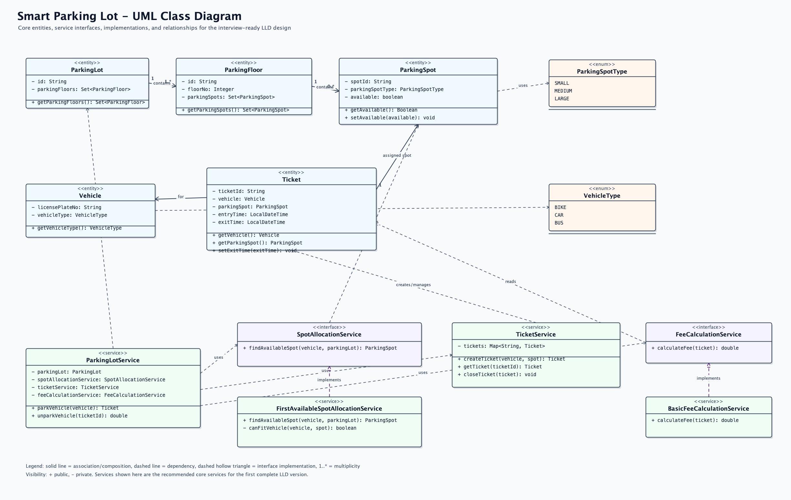

# 🅿️ Smart Parking Lot System

A complete Low-Level Design (LLD) implementation of a multi-floor, multi-spot Smart Parking Lot System in Java 21.

---

## 📋 Problem Statement & Requirements

Design an automated parking lot management system capable of:
1. **Multi-Floor Support**: Managing multiple parking floors with configurable capacities.
2. **Vehicle Spot Mapping**:
   - `BIKE` -> `SMALL` spots
   - `CAR` -> `MEDIUM` spots
   - `TRUCK` -> `LARGE` spots
3. **Automated Spot Allocation**: Finding and assigning available spots upon vehicle arrival.
4. **Ticketing System**: Generating tickets with entry timestamps and spot details upon check-in.
5. **Fee Calculation & Checkout**: Calculating parking fees based on duration upon checkout, freeing the spot automatically.

---

## 🏛️ Architecture & UML



### Key Components

- **`model/`**:
  - `ParkingLot`: Container entity holding floors and configuration.
  - `ParkingFloor`: Represents an individual floor containing parking spots.
  - `ParkingSpot`: Represents an individual slot (`SMALL`, `MEDIUM`, `LARGE`), tracks availability and parked vehicle.
  - `Vehicle`: Vehicle representation with license plate and `VehicleType`.
  - `Ticket`: Contains entry/exit timestamps, spot reference, and unique ticket ID.
- **`enums/`**:
  - `VehicleType`: `BIKE`, `CAR`, `TRUCK`
  - `ParkingSpotType`: `SMALL`, `MEDIUM`, `LARGE`
- **`service/`**:
  - `ParkingService`: Facade / coordinator for parking and unparking workflows.
  - `SpotAllocationService`: Finds eligible available spots across floors.
  - `TicketService`: Manages ticket creation and lookup.
  - `FeeCalculationService`: Computes fees based on elapsed duration.
  - `PaymentService`: Processes payment transactions at checkout.
- **`utils/`**:
  - `IdGenerator`: Thread-safe / sequential ID generation.
  - `LicensePlateGenerator`: Generates test license plates.

---

## 💡 Design Patterns & Principles

- **Single Responsibility Principle (SRP)**: Allocation, fee calculation, payment, and ticketing are decoupled into distinct services.
- **Facade Pattern**: `ParkingService` acts as a unified interface hiding underlying coordination between allocation, ticketing, and payment.
- **Strategy Pattern (Extensibility)**: Allocation logic and fee calculation can be swapped with different strategies (e.g., nearest-to-entrance vs. random).

---

## 🚀 How to Run

### Run Interactive Console Demo
From the repository root:
```bash
mvn exec:java -pl smart-parking-lot
```
Or right-click and run `Main.java` in IntelliJ IDEA.

### Run Unit Tests
```bash
mvn test -pl smart-parking-lot
```
