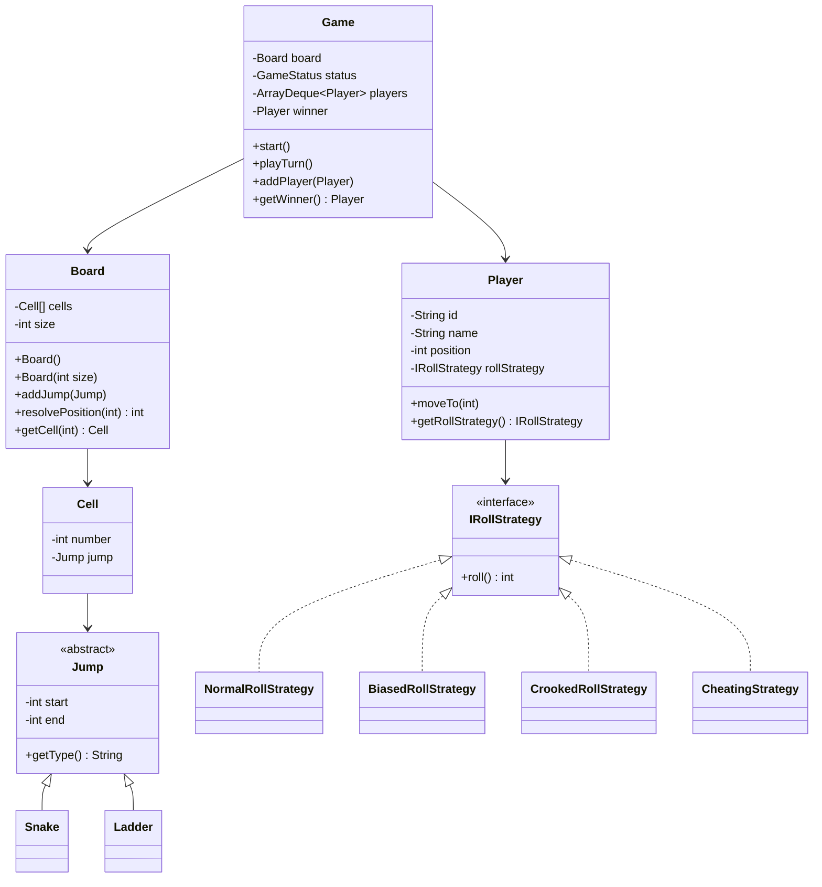

# Snake and Ladder Game

This module contains a simple Java implementation of the classic Snake and Ladder game using low-level design principles.

The focus is on clean object design: board setup, players, snakes, ladders, turn handling, and dice roll behavior.

## Features

- Configurable board size. Default board size is 100.
- Multiple players.
- Round-robin turns.
- Snakes and ladders using a common `Jump` abstraction.
- Exact landing rule to win.
- Overshoot handling.
- Extra turn on rolling `6`.
- Player-specific roll strategies for normal, biased, crooked, or cheating players.

The game resolves only one snake or ladder per move. If a ladder takes a player from `2` to `38`, the move stops at `38`; it does not check for another jump on `38`.

## Structure

Main files:

```text
models/       Board, Cell, Game, Player, Jump, Snake, Ladder, Dice
strategy/     NormalRollStrategy, BiasedRollStrategy, CrookedRollStrategy, CheatingStrategy
interfaces/   IRollStrategy
enums/        GameStatus
Main.java     Console runner
```

## Design

Here is the simplified UML.



## Sample Setup

```java
Board board = new Board(100);

board.addJump(new Ladder(2, 38));
board.addJump(new Ladder(15, 35));

board.addJump(new Snake(67, 45));
board.addJump(new Snake(75, 38));
board.addJump(new Snake(90, 8));

Queue<Player> players = new ArrayDeque<>(List.of(
        new Player("Player 1", "Rohit", new BiasedRollStrategy(6)),
        new Player("Player 2", "Vishal", new CheatingStrategy()),
        new Player("Player 3", "Guru", new CheatingStrategy())
));

Game game = new Game(board, players);
game.start();
```

`Board` validates invalid jumps, duplicate jump starts, invalid cell numbers, and jumps starting from the final cell.

`Player` owns an `IRollStrategy`, so different players can roll differently. A normal player can use the default constructor:

```java
Player normalPlayer = new Player("P1", "Rohit");
Player cheatingPlayer = new Player("P2", "Vishal", new CheatingStrategy());
```

`Dice` is kept as an optional reusable model. If all players should share the same rolling behavior, `Game` can own one `Dice` and call `dice.roll()` every turn.

## Rules

1. Every player starts at position `0`.
2. Players take turns in queue order.
3. A player rolls using their assigned roll strategy.
4. If the move crosses the final cell, the player does not move.
5. If the player lands on a snake or ladder start, the player moves to that jump's end.
6. If the player rolls `6`, the same player gets the next turn.
7. The first player to reach the final cell wins.

## Possible Improvements

- full leaderboard instead of stopping after the first winner
- cancelling a turn after three consecutive sixes
- chained jump resolution
- custom board loaders from input or config files

## Run

From the root of this repository:

```bash
mvn exec:java -pl snake-and-ladder
```
