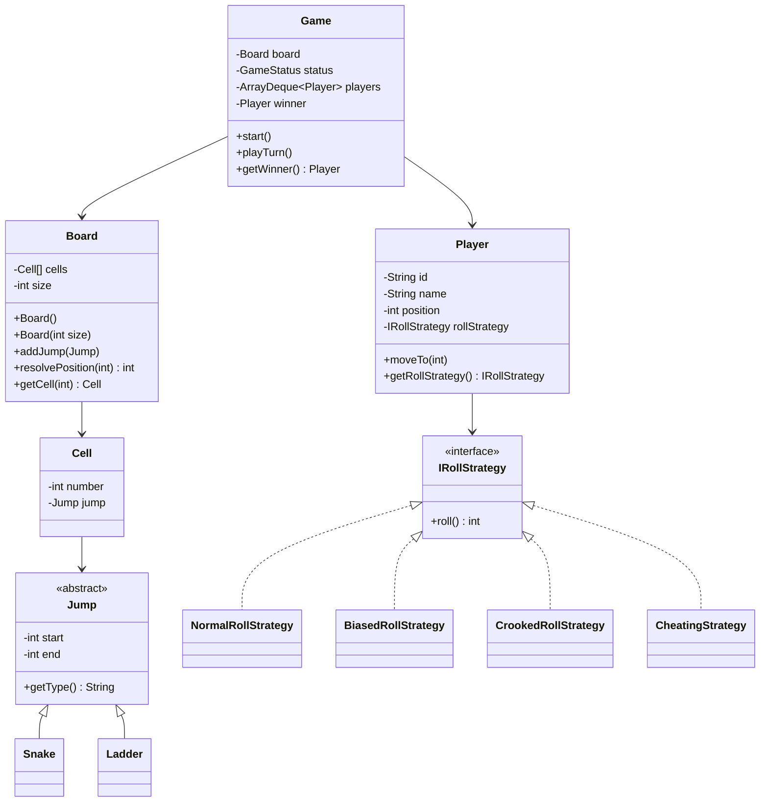

# Snake and Ladder Game

This module contains a simple Java implementation of the classic Snake and Ladder game using low-level design principles.

The focus is on clean object design: board setup, players, snakes, ladders, turn handling, and dice roll behavior.

## Problem Statement

Basic Board: On a board (Of size 100), for a dice throw a player should move from the initial position by the number on dice throw.

Add a snake on the board: A snake moves a player from its start position to end position. where start position > end position  
Test data: Add a snake at position 14 moving the player to position 7.

Make A Crooked Dice: A dice that only throws Even numbers. The can game can be started with normal dice or crooked dice.

One more crookedness could be:  
Biased/Weighted Die: The dice has a higher probability of landing on a specific number (e.g., 6).

## Clarifying With The Interviewer

Before jumping into classes, it is better to clarify the rules. This helps avoid building either too little or too much.

**Candidate:** Should I assume the board size is always 100, or should it be configurable?

**Interviewer:** Start with 100, but keep it configurable if possible.

**Candidate:** Got it. I will create a `Board` with a default size of 100 and also allow `new Board(size)`.

**Candidate:** Can there be multiple players, or should I design it for a single player first?

**Interviewer:** Design it for multiple players.

**Candidate:** I will keep players in a turn queue so they play in round-robin order.

**Candidate:** For snakes and ladders, should I model them separately or as one common concept?

**Interviewer:** They are similar, but their validation is different.

**Candidate:** I will create an abstract `Jump` and extend it with `Snake` and `Ladder`. A snake will validate `start > end`, and a ladder will validate `start < end`.

**Candidate:** If a player crosses the final cell, should they win or stay where they are?

**Interviewer:** The player should land exactly on the final cell.

**Candidate:** Then I will follow the exact landing rule. If the move crosses the final cell, the player will not move.

**Candidate:** If a player rolls a `6`, should they get another turn?

**Interviewer:** Yes, add that rule.

**Candidate:** I will place the player back at the front of the turn queue when they roll `6`.

**Candidate:** The problem mentions normal, crooked, and biased dice. Should dice behavior be changeable?

**Interviewer:** Yes, the game should support different dice behavior.

**Candidate:** I will use a roll strategy interface. `NormalRollStrategy`, `CrookedRollStrategy`, and `BiasedRollStrategy` can implement it.

**Candidate:** Should all players use the same dice, or can each player have a different rolling behavior?

**Interviewer:** What would you choose?

**Candidate:** I will keep roll strategy at the player level. That lets one player be normal and another player be biased or cheating. If the game needs one shared dice later, we can use the `Dice` model inside `Game`.

**Candidate:** If a ladder ends on another snake or ladder start, should we keep resolving jumps?

**Interviewer:** Keep it simple. Resolve only one jump per move.

**Candidate:** Perfect. I will document that chained jumps are not supported in this version.

## Features

- Configurable board size. Default board size is 100.
- Multiple players.
- Round-robin turns.
- Snakes and ladders using a common `Jump` abstraction.
- Exact landing rule to win.
- Overshoot handling.
- Extra turn on rolling `6`.
- Player-specific roll strategies for normal, biased, crooked, or cheating players.

The game resolves only one snake or ladder per move. If a ladder takes a player from `2` to `38`, the move stops at `38`; it does not check for another jump on `38`.

## Structure

Main files:

```text
models/       Board, Cell, Game, Player, Jump, Snake, Ladder, Dice
strategy/     NormalRollStrategy, BiasedRollStrategy, CrookedRollStrategy, CheatingStrategy
interfaces/   IRollStrategy
enums/        GameStatus
SnakeAndLadder.java     Console runner
```

## Design

Here is the simplified UML.



## Sample Setup

```java
Board board = new Board(100);

board.addJump(new Ladder(2, 38));
board.addJump(new Ladder(15, 35));

board.addJump(new Snake(67, 45));
board.addJump(new Snake(75, 38));
board.addJump(new Snake(90, 8));

Queue<Player> players = new ArrayDeque<>(List.of(
        new Player("Player 1", "Rohit", new BiasedRollStrategy(6)),
        new Player("Player 2", "Vishal", new CheatingStrategy()),
        new Player("Player 3", "Guru", new CheatingStrategy())
));

Game game = new Game(board, players);
game.start();
```

`Board` validates invalid jumps, duplicate jump starts, invalid cell numbers, and jumps starting from the final cell.

`Player` owns an `IRollStrategy`, so different players can roll differently. A normal player can use the default constructor:

```java
Player normalPlayer = new Player("P1", "Rohit");
Player cheatingPlayer = new Player("P2", "Vishal", new CheatingStrategy());
```

`Dice` is kept as an optional reusable model. If all players should share the same rolling behavior, `Game` can own one `Dice` and call `dice.roll()` every turn.

## Rules

1. Every player starts at position `0`.
2. Players take turns in queue order.
3. A player rolls using their assigned roll strategy.
4. If the move crosses the final cell, the player does not move.
5. If the player lands on a snake or ladder start, the player moves to that jump's end.
6. If the player rolls `6`, the same player gets the next turn.
7. The first player to reach the final cell wins.

## Possible Improvements

- full leaderboard instead of stopping after the first winner
- cancelling a turn after three consecutive sixes
- chained jump resolution
- custom board loaders from input or config files

## Run

From the root of this repository:

```bash
mvn exec:java -pl snake-and-ladder
```
